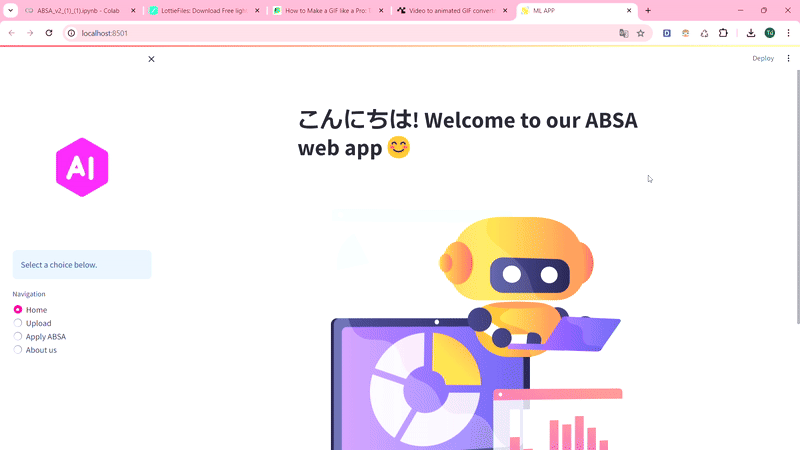

<h1 align="center">
  <br>
  <a href=""></a>
  <br>
  Junior-VB🤖
  <br>
</h1>

<h4 align="center">A model and web app service in <a href="https://monkeylearn.com/blog/what-is-aspect-based-sentiment-analysis/" target="_blank">ABSA</a> abot smartphone review.</h4>

<p align="center">
  <a href="https://jvb-corp.com/vi"></a>
  <a href="https://img.shields.io/badge/release-1.0.0-black?color=%23c6e2ff">
      
  </a>
  <a href="https://www.facebook.com/lnht1808.secsip">
    
  </a>
  <a href="https://mail.google.com/mail/u/3/#inbox">
    
  </a>
  <a href="https://img.shields.io/badge/license-MIT-green?style=flat&labelColor=gray">
    
  </a>
</p>

<p align="center">
  <a href="#about-web">About Web</a> •
  <a href="#about-model">About Model</a> •
  <a href="#credits">Credits</a> •
  <a href="#related">Related</a> •
  <a href="#license">License</a>
</p>

<p align="center">
  
<p>

## 🤗About Web

* 📝Predict random text from keyboard
  - You can try our service by enter some review about phone before uploading file.
  - By this, you can understand clearly our result.
* 🗂️Upload file
  - The limit space of streamlit is 200MB. We sorry about that.
  - From now, our model accepts 3 type of file: csv, json and excel.
  - The processing for file input may take time depending on size of file.

## 📈About Model
### 🤝Pre-trained Model And Fine-tuning
 - We using [PhoBERT-base](https://huggingface.co/vinai/phobert-base) model, which was created by [VinAI](https://github.com/VinAIResearch) for our  problem and the inspire of fine-tuning by [Quan Dang](https://github.com/ds4v/absa-vlsp-2018).
 - You can read more details in this [paper](https://github.com/ds4v/absa-vlsp-2018/blob/main/Paper.pdf).
 - With our model, we use more slower learning rate and small weight decay of AdamW for more aspect and more data and it performance look better.

### 🧑‍💻How To Use

To clone and run this application, you'll need [Git](https://git-scm.com) and [Pip](https://pip.pypa.io/en/stable/installation/) installed on your computer. From your command line:

```bash
# Clone this repository
$ git clone https://github.com/leanhtu-AI/Sentiment-Analysis.git

# Go into the repository
$ cd Sentiment-Analysis

# Install dependencies
$ pip install requirements.txt

# For running the app
$ streamlit run app.py

# For training the model
$ python train.py

```

> [!NOTE]  
> We use the Windows command, if you are running on MacOS or Linux, it can be different a bit.

## 👉Credits
This repo uses the following open source packages:
- [Tensorflow](https://www.tensorflow.org/?hl=vi)
- [Streamlit](https://streamlit.io/)
- [Transformers](https://github.com/huggingface/transformers)
- [Underthesea](https://github.com/undertheseanlp/underthesea)
- [nltk](https://github.com/nltk/nltk)
- [Regex](https://github.com/ziishaned/learn-regex)
- [Numpy](https://numpy.org/)
- [Pandas](https://pandas.pydata.org/)
- [Matplotlib](https://matplotlib.org/stable/)

## 📢Related
[Junior-VB-web]() - Web version link of our model.

> [!IMPORTANT]
> We encourage you to run this by streamlit on local becaue the web is not always available on streamlit cloud.

## 📝License

MIT
