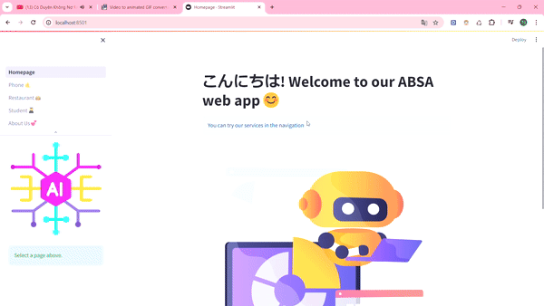

<h1 align="center">
   
  
   
  Junior-VB - New version🤖
   
</h1>

<h4 align="center">A model and web app service in <a href="https://monkeylearn.com/blog/what-is-aspect-based-sentiment-analysis/" target="_blank">ABSA</a></h4>

  
  
  
  
  
  

  <a href="#whatnews">What's New?</a> •  
  <a href="#data">Data</a> •
  <a href="#result">Model</a> •  

  

## 📁Data
* For [restaurant data](https://github.com/htuannn/ABSA-VLSP2018/tree/main/data), we collect them on github which was created in ABSA-VLSP 2018 competition. 
* For [student data](https://drive.google.com/drive/folders/1xclbjHHK58zk2X6iqbvMPS2rcy9y9E0X), we collect on the website [The UIT NLP Group](https://nlp.uit.edu.vn/datasets/)

### 🌊Results
 - We not change much for model, so the result is not good like on the smartphone dataset
 - Restaurant

Tasks | Precision | Recall  | F1-Score  
---|---|---|---
Aspect Detection | 79.97 | 53.41 | 52.64
Polarity Detection | 62.12 | 52.66 | 55.11
Aspect + Polarity | 75.02 |	37.24 |	36.25

- Student

Tasks | Precision | Recall  | F1-Score  
---|---|---|---
Aspect Detection | 90.21 | 87.56 | 88.56 |
Polarity Detection | 80.59 | 77.86 | 78.66 |
Aspect + Polarity | 78.39 | 68.00 | 68.41 |

- Student

Tasks | Precision | Recall  | F1-Score  
---|---|---|---
Aspect Detection | 86.99 | 77.42	| 80.85
Polarity Detection | 85.82 | 69.57 | 71.86
Aspect + Polarity | 80.56 |	54.09	| 56.43

